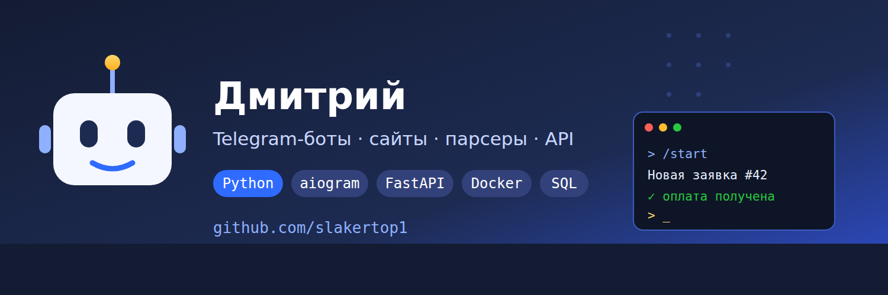

## Привет! 👋

Меня зовут **Дмитрий**. Разрабатываю **Telegram-ботов, сайты и автоматизацию** на
Python. Работаю под ключ: от постановки задачи до запуска на сервере и поддержки.

### 🧰 Стек

`Python` · `aiogram` · `FastAPI` · `SQLite` · `Docker` · `Linux` · `HTML / CSS / JS`

### 📂 Проекты

| Проект | Что это | Демо |
|---|---|---|
| 🤖 [**telegram-order-bot**](https://github.com/slakertop1/telegram-order-bot) | Бот приёма заявок: оформление за 4 шага, оплата аванса, админ-панель, рассылки | [@slaker_orders_bot](https://t.me/slaker_orders_bot) |
| 🌐 [**lead-landing**](https://github.com/slakertop1/lead-landing) | Лендинг с формой заявок — лиды приходят в Telegram | [live](https://slaker-demo.duckdns.org:8443) |
| 🛒 [**food-shop-landing**](https://github.com/slakertop1/food-shop-landing) | Интернет-магазин: каталог, корзина, онлайн-оплата ЮKassa | [live](https://slaker-shop.duckdns.org:8443) |
| 🚀 [**telegram-mini-app**](https://github.com/slakertop1/telegram-mini-app) | Мини-приложение в Telegram: магазин с нативной темой и проверкой подписи | — |

### 💡 Чем могу помочь

- **Telegram-боты** — приём заявок и заказов, оплата в чате, интеграции с CRM / Google Sheets
- **Сайты и лендинги** — с формами, приёмом заявок и онлайн-оплатой
- **Парсеры и автоматизация** — сбор данных в Excel/Таблицы, скрипты по расписанию
- **API** — разработка, интеграции, нагрузочное тестирование

### 📫 Связь

Написать по задаче — через демо-бота [@slaker_orders_bot](https://t.me/slaker_orders_bot)
или [issues](https://github.com/slakertop1) в любом из проектов.
